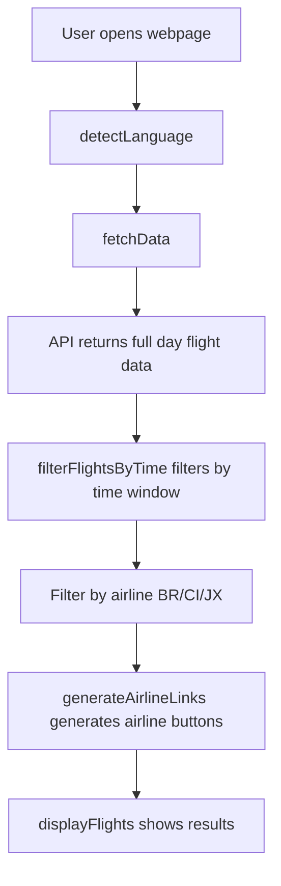

# AI Knowledge Transfer System
# Taipei Sushi Go Round 🍣 - AI Knowledge Transfer Document

## Project Overview
This is a Taoyuan International Airport flight information system designed specifically for flight crew members to quickly check baggage carousel information using mobile devices.

### Core Features
- Query arrival and departure flights for Taiwan's three major airlines (BR/CI/JX)
- Dynamic time window filtering: 2-hour window based on current time
- Multi-language support (Traditional Chinese/English/Japanese)
- Theme switching (Light/Dark mode)
- Responsive design

## Critical Technical Decisions & Historical Issues

### 1. Time Window Logic (IMPORTANT!)
**Issue History**: BR35 flight display problem - scheduled time 05:05 outside window, actual time 05:39 within window, but not displaying

**Root Cause**: API request stage was sending time range parameters, causing API to only return flights with OTime within range

**Solution**: 
- Send `OTimeOpen: null, OTimeClose: null` in API requests to fetch full day data
- Use client-side `filterFlightsByTime()` for precise filtering
- Filtering logic: `isODateTimeInRange || isRDateTimeInRange` (display if either scheduled or actual time is within range)

### 2. Time Window Configuration
Location: `main.js:257-271` getTimeWindowConfig()
- Arrival mode (A): Start 40 minutes before current time, duration 120 minutes
- Departure mode (D): Start at current time, duration 120 minutes
- Time rounding: 10-minute intervals

### 3. Dual Filtering Mechanism
1. **Data Fetching**: API request for all flights (OTimeOpen/OTimeClose = null)
2. **Client-side Filtering**: filterFlightsByTime() filters by time window
3. **Airline Filtering**: Only display BR/CI/JX, exclude cancelled flights
4. **User Filtering**: Filter by user-selected airline

### 4. E2E Testing Optimizations (NEW!)
**Smart API Caching**: To prevent DDoS on Taoyuan Airport API while maintaining test quality
- First test makes real API call and caches response for 30 minutes
- Subsequent tests use cached real data with language transformations
- Graceful fallback to mock data if real API fails
- Blocks Google Analytics requests to prevent data pollution

**CI/CD Optimizations**:
- Local and production E2E tests use identical exit node connectivity checks
- Removed problematic API connectivity test from CI (403 errors)
- Only basic Taiwan route accessibility test needed for VPN validation

## Code Architecture

### Main Functions
- `fetchData()`: API data fetching (main.js:308-386)
- `filterFlightsByTime()`: Time range filtering (main.js:468-487)
- `getTimeWindow()`: Time window calculation (main.js:283-290)
- `displayFlights()`: Data display (main.js:518-565)

### Test Helper Functions (E2E)
- `blockGoogleAnalytics()`: Prevents GA tracking during tests (e2e/test-helpers.js)
- `setupSmartApiRoute()`: Smart caching for real API data (e2e/test-helpers.js)
- `setupMockApiRoute()`: Traditional mock for unit tests (e2e/test-helpers.js)

### Data Flow


### Key Constants
- `AIRLINE_CODES`: ['BR', 'CI', 'JX']
- `API_URL`: 'https://www.taoyuan-airport.com/api/api/flight/a_flight'
- `CACHE_DURATION`: 30 minutes (for smart API caching)

## Testing System

### Test Architecture
- **Unit Tests** (Vitest): Test core logic including API parsing, time calculation, filtering logic
- **E2E Tests** (Playwright): Test complete functionality including user interactions, cookies, responsive design
- **Smart API Caching**: First call uses real API, subsequent calls use cached data
- **CI/CD Integration**: GitHub Actions automatically runs tests and deploys

### Key Test Cases
1. **BR35 Regression Test**: Ensure flights with actual time within range display correctly
2. **API Parameter Validation**: Ensure `OTimeOpen` and `OTimeClose` always remain `null`
3. **Data Consistency**: Page display must match API parsing results
4. **Cookie Persistence**: Airline selection, theme, language settings persistence
5. **Google Analytics Blocking**: Prevent test traffic from polluting GA data
6. **Smart Caching**: Real API data cached and reused efficiently

### Test Commands
```bash
npm run test              # Unit tests
npm run test:e2e:local    # Local E2E tests (skips production tests)
npm run test:e2e:prod     # Production E2E tests (includes real site validation)
```

> **Worker Configuration**:
> - **Local** (`npm run test:e2e:local`): configured in `playwright.local.config.js` to use `os.cpus().length` workers for maximum parallelism.
> - **CI (GitHub Actions)**: configured to use 2 workers for stable test runs.

### Shared Utility Functions
Location: `src/utils/flightUtils.js`
- Core logic extracted from main.js for reuse in tests
- Includes API parsing, time calculation, filtering functions
- Ensures test logic matches actual program logic completely

## Common Issues Troubleshooting

### Q: Why isn't a certain flight displaying?
1. Check if flight's OTime and RTime are within time window
2. Confirm airline code is BR/CI/JX
3. Check if flight is cancelled (Memo contains "取消" or "cancelled")

### Q: Time display incorrect?
- All times use UTC+8 (Taipei time)
- Time window calculated based on current local time

### Q: API request failed?
- Check network connection
- Confirm postData format is correct, especially OTimeOpen/OTimeClose should be null
- Smart caching will automatically fall back to mock data

### Q: E2E tests failing?
- Check if exit node connectivity is working (CI logs)
- Verify smart API caching is functioning (look for cache logs)
- Ensure Google Analytics blocking is active

## Update History
- 2025/06/09: Implemented smart API caching and Google Analytics blocking for E2E tests
- 2025/06/09: Unified exit node connectivity tests between local and production CI
- 2025/06/08: Fixed BR35 display issue, changed to API request full day data, client-side filtering
- 2025/06/07: Refactored time window logic, unified A/D mode time handling

## Development Reminders
1. **Never set time range in API requests** - Must fetch full day data for client-side filtering
2. Pay attention to timezone issues during testing, all times are UTC+8
3. Adding new airlines requires updating both AIRLINE_CODES and CSS styles
4. Language switching reloads data, consider performance
5. **Run tests for every logic change** - Avoid regression issues
6. **New features must have corresponding tests** - Maintain test coverage
7. **E2E tests use smart caching** - First call gets real data, subsequent calls use cache
8. **Block GA in tests** - Use `blockGoogleAnalytics()` in all E2E test setup
9. **Keep CI exit node tests simple** - Only basic connectivity checks, not API validation

---
*This document is created by AI assistant for quick context establishment in new sessions*