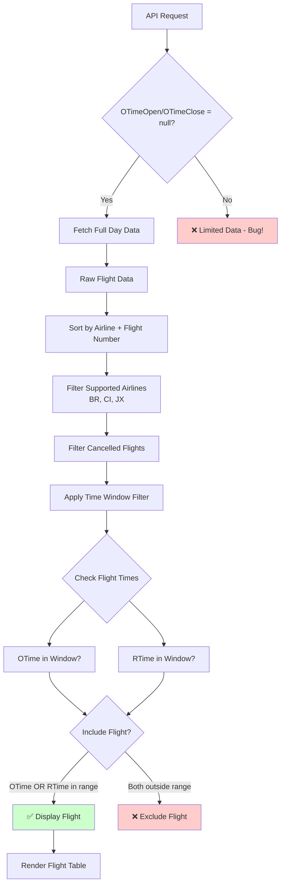
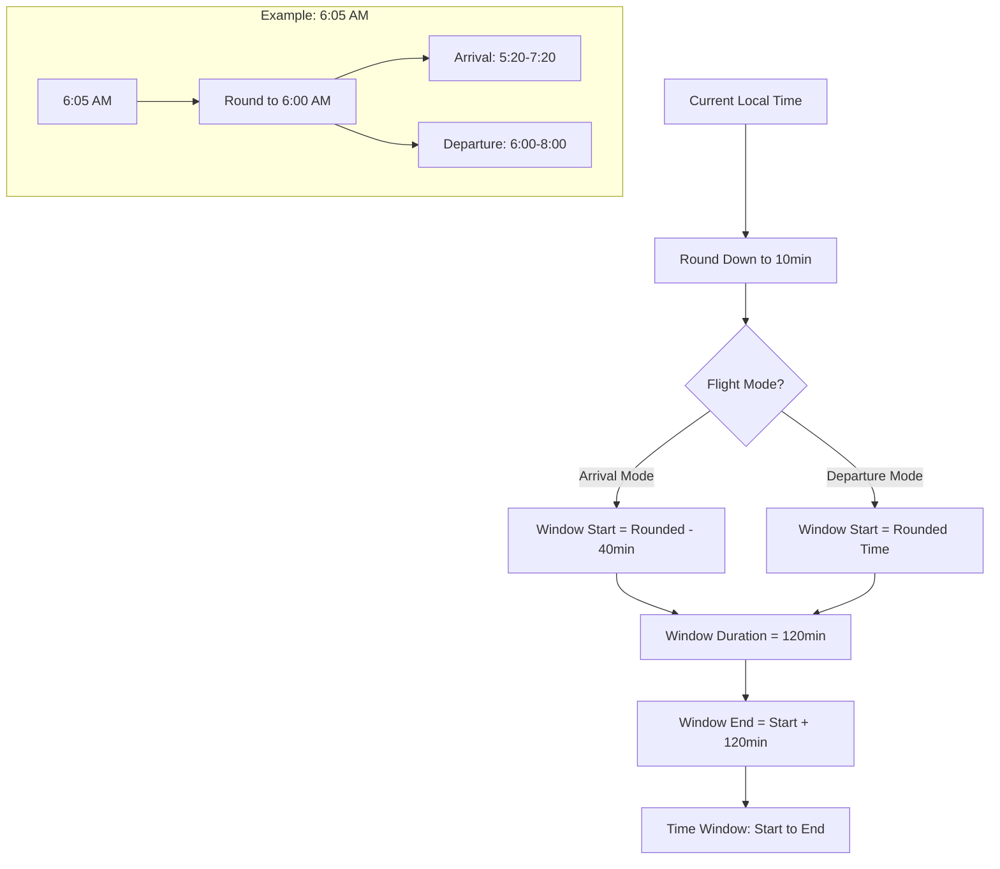
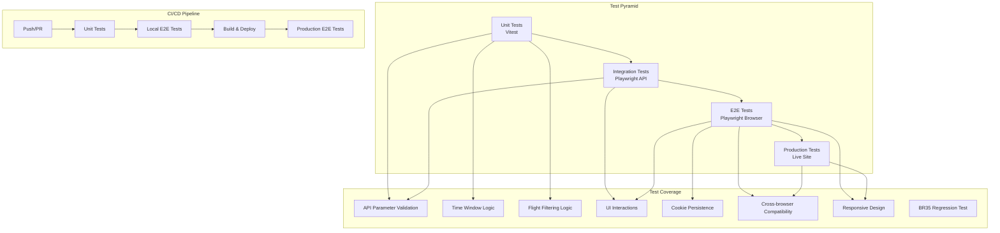
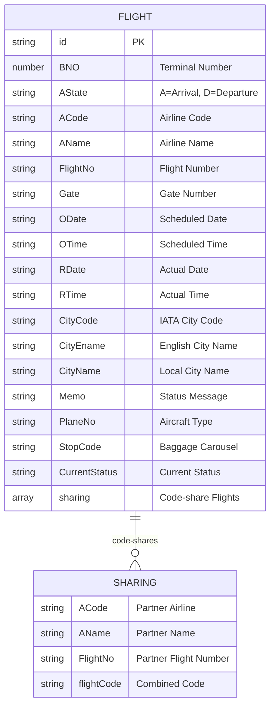

# Taipei Sushi Go Round 🍣

[](https://github.com/tpe-eagle/tpe-sushi-go-round/actions/workflows/ci.yml)
[](https://opensource.org/licenses/MIT)
[](https://github.com/tpe-eagle/tpe-sushi-go-round/commits/main)

A responsive web application for quickly checking Taoyuan International Airport baggage carousel information for Taiwan's major airlines (EVA Air, China Airlines, STARLUX Airlines). Designed specifically for flight crew members to get off work faster! 🛫

## 🌟 Features

- **Real-time Flight Data**: Fetches live arrival and departure information
- **Smart Time Window**: Dynamic 2-hour window based on current time
- **Multi-airline Support**: BR (EVA Air), CI (China Airlines), JX (STARLUX Airlines)
- **Multilingual**: Traditional Chinese, English, Japanese
- **Localized API Requests**: Include `Accept-Language` header matching the UI language to fetch airline names in the selected language
- **Responsive Design**: Optimized for mobile devices
- **Dark/Light Theme**: Automatic theme detection with manual override
- **Progressive Web App**: Installable on mobile devices

## 🏗️ Architecture Overview

```mermaid
graph TB
    subgraph "Client Side"
        A[User Browser] --> B[Vite SPA]
        B --> C[Main Application]
        C --> D[Flight Data Manager]
        C --> E[UI Components]
        C --> F[Cookie Manager]
    end
    
    subgraph "External Services"
        G[Taoyuan Airport API]
    end
    
    subgraph "Data Flow"
        D --> |Fetch All Day Data| G
        G --> |JSON Response| D
        D --> |Filter by Time Window| H[Filtered Results]
        H --> E
    end
    
    subgraph "State Management"
        I[Language State]
        J[Theme State]
        K[Airline Filter State]
        L[Flight Mode State]
    end
    
    F --> I
    F --> J
    F --> K
    E --> I
    E --> J
    E --> K
    E --> L
```



## 🔄 Data Processing Flow



## ⏰ Time Window Logic



## 🧪 Testing Architecture



## 🚀 Quick Start

### Prerequisites
- Node.js 18+
- npm or yarn

### Installation
```bash
git clone https://github.com/tpe-eagle/tpe-sushi-go-round.git
cd tpe-sushi-go-round
npm install
```

### Development
```bash
npm run dev
```
Visit http://localhost:8080

### Build for Production
```bash
npm run build
```

### Testing
```bash
# Unit tests (Vitest)
npm run test
npm run test:ui          # Interactive test UI

# E2E tests (Playwright)
npm run test:e2e:local   # Test local dev server
npm run test:e2e:prod    # Test production site
```

#### Test Architecture
The project follows a comprehensive testing pyramid:
1. **Unit Tests** (Vitest) - Core business logic validation
2. **E2E Tests** (Playwright) - Complete user workflow testing
3. **CI/CD Pipeline** - Automated testing on GitHub Actions

#### Test Coverage
- ✅ **API Logic**: Parameter validation (`OTimeOpen/OTimeClose = null`), time window calculation
- ✅ **Flight Filtering**: Scheduled OR actual time in range, airline filtering, cancelled flight exclusion
- ✅ **BR35 Regression**: Critical fix ensuring flights display when actual time in range
- ✅ **UI Functionality**: Cookie persistence (airline, theme, language), responsive design
- ✅ **Cross-platform**: Multi-browser and mobile device compatibility

#### Key Test Files
- `src/test/api.test.js` - Unit tests for flight parsing and filtering logic
- `e2e/api-integration.spec.js` - API parameter and response validation
- `e2e/user-interaction.spec.js` - UI interactions and cookie persistence
- `e2e/production.spec.js` - Live site validation tests

## 📊 Flight Data Structure



## 🔧 Configuration

### Environment Variables
```bash
# Base path for GitHub Pages deployment
VITE_BASE_PATH=/tpe-sushi-go-round/

# API endpoint (default: Taoyuan Airport)
VITE_API_URL=https://www.taoyuan-airport.com/api/api/flight/a_flight
```

### Supported Airlines
- **BR** - EVA Air (長榮航空)
- **CI** - China Airlines (中華航空)
- **JX** - STARLUX Airlines (星宇航空)

### Playwright Workers Configuration
- **Local** (`playwright.local.config.js`): uses `os.cpus().length` workers based on CPU cores for maximum parallelism.
- **CI** (`playwright.local.config.js` when `CI=true`): uses 2 workers for stable test runs.

### Time Window Configuration
- **Arrival Mode**: Current time - 40 minutes → Current time + 80 minutes
- **Departure Mode**: Current time → Current time + 120 minutes
- **Rounding**: 10-minute intervals
- **Timezone**: UTC+8 (Asia/Taipei)

## 🐛 Known Issues & Solutions

### BR35 Display Issue (Resolved)
**Problem**: Flight BR35 with scheduled time 05:05 and actual time 05:39 didn't show during 05:20-07:20 window.

**Root Cause**: API request was sending time range parameters, limiting server response.

**Solution**: Always send `OTimeOpen: null` and `OTimeClose: null` to fetch full day data, then filter client-side.

```javascript
// ❌ Wrong - limits API response
postData.OTimeOpen = "05:20";
postData.OTimeClose = "07:20";

// ✅ Correct - gets all flights
postData.OTimeOpen = null;
postData.OTimeClose = null;
```

## 🤝 Contributing

1. Fork the repository
2. Create a feature branch (`git checkout -b feature/amazing-feature`)
3. Run tests (`npm run test && npm run test:e2e:local`)
4. Commit your changes (`git commit -m 'Add amazing feature'`)
5. Push to the branch (`git push origin feature/amazing-feature`)
6. Open a Pull Request

### Development Guidelines
- All code comments must be in English
- UI text remains in Traditional Chinese (for Taiwanese users)
- Every feature must have corresponding tests
- Maintain test coverage above 80%
- Follow the existing code style

## 📈 Performance Considerations

- **API Optimization**: Single request for all flights, client-side filtering
- **Responsive Images**: Airline logos with appropriate sizing
- **Caching**: Static assets cached with service worker
- **Bundle Size**: Tree-shaking enabled, minimal dependencies

## 🌐 Browser Support

- Chrome 90+
- Firefox 88+
- Safari 14+
- Edge 90+
- Mobile browsers (iOS Safari, Chrome Mobile)

## 📝 License

This project is licensed under the MIT License - see the [LICENSE](LICENSE) file for details.

## 🙏 Acknowledgments

- Taoyuan International Airport for providing the flight data API
- Taiwan's aviation community for inspiration
- All the flight crew members who deserve to get off work faster! ✈️

---

Made with ❤️ by EVA Pilot for Taiwan's aviation community