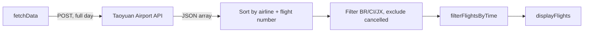
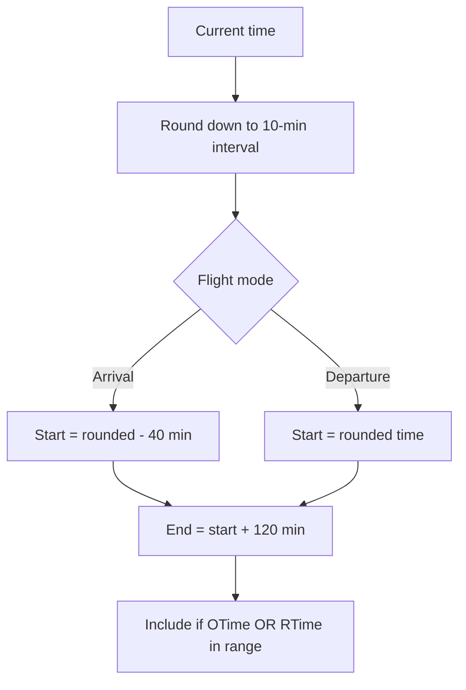
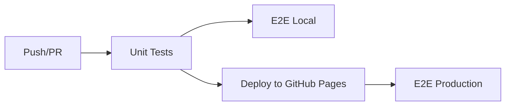

# TPE Sushi Go Round

[](https://github.com/tpe-eagle/tpe-sushi-go-round/actions/workflows/ci.yml)
[](https://opensource.org/licenses/MIT)

A mobile-first web app for Taoyuan International Airport flight information. Flight crew members can quickly check baggage carousel and departure gate info for Taiwan's three major airlines.

**Live Site**: [https://tpe-eagle.github.io/tpe-sushi-go-round/](https://tpe-eagle.github.io/tpe-sushi-go-round/)

## Features

- Real-time arrival and departure flight data from Taoyuan Airport API
- Smart time window filtering: 2-hour window based on current time
- Three airlines: BR (EVA Air), CI (China Airlines), JX (STARLUX Airlines)
- Multilingual: Traditional Chinese, English, Japanese
- Dark/light theme with system preference detection and cookie persistence
- Responsive mobile-first design (768px breakpoint)
- Progressive Web App (installable on mobile)
- Pull-to-refresh on mobile

## Quick Start

```bash
npm install
npm run dev       # http://localhost:8080
```

## Project Structure

```
tpe-sushi-go-round/
├── main.js                      # Application logic (fetch, filter, display, i18n, theme)
├── style.scss                   # SCSS styling with CSS variables and animations
├── index.html                   # SPA entry point (meta tags, CSP, preloads)
├── vite.config.js               # Vite build + Vitest config
├── src/
│   ├── utils/flightUtils.js     # Shared utilities (used by app and tests)
│   └── test/                    # Unit tests (Vitest)
│       ├── api.test.js          # Flight parsing, filtering, BR35 regression
│       ├── cache.test.js        # localStorage caching lifecycle
│       ├── etag-integration.test.js  # ETag/304 support
│       └── setup.js             # Global test mocks
├── e2e/                         # E2E tests (Playwright)
│   ├── test-helpers.js          # Smart API caching, GA blocking, mock data
│   ├── api-integration.spec.js  # API parameter validation
│   ├── language-detection.spec.js  # Browser language detection
│   ├── user-interaction.spec.js # Cookie persistence, responsive layout
│   └── production.spec.js       # Live site validation
├── .claude/                     # Claude Code config and commands
├── .github/workflows/ci.yml    # CI/CD pipeline
└── public/                      # PWA icons and manifest
```

## Data Flow



- API always receives `OTimeOpen: null, OTimeClose: null` to fetch all flights
- Time window filtering is strictly client-side
- localStorage cache: 2-minute expiry, max 5 entries, disabled on localhost

## Time Window



| Mode | Offset | Duration | Example (6:05 AM) |
|------|--------|----------|-------------------|
| Arrival (A) | -40 min | 120 min | 5:20 - 7:20 |
| Departure (D) | 0 min | 120 min | 6:00 - 8:00 |

Flight is displayed if **either** scheduled time (ODateTime) **or** actual time (RDateTime) falls within the window. All times are UTC+8.

## API Contract

| Field | Value |
|-------|-------|
| Endpoint | `https://www.taoyuan-airport.com/api/api/flight/a_flight` |
| Method | POST |
| OTimeOpen / OTimeClose | Always `null` (fetch full day) |
| AState | `A` (arrival) or `D` (departure) |
| language | `ch` / `en` / `jp` (note: Chinese is `ch`, not `zh`) |

## State & Persistence

| State | Storage | Expiry |
|-------|---------|--------|
| Airline filter (`ACode`) | Cookie | 7 days |
| Theme (`theme`) | Cookie | 7 days |
| Language | Browser detection | Not persisted |
| Flight data cache | localStorage | 2 minutes |

## Testing

```bash
npm run test:run          # Unit tests (Vitest)
npm run test:e2e:local    # Local E2E (Playwright, chromium)
npm run test:e2e:prod     # Production E2E (live site, multi-browser)
```

| Test File | Coverage |
|-----------|----------|
| `api.test.js` | API post data, time window, flight filtering, BR35 regression |
| `cache.test.js` | localStorage lifecycle, expiry, cleanup, quota exceeded |
| `etag-integration.test.js` | ETag/304 conditional requests (`NODE_ENV=integration`) |
| `api-integration.spec.js` | API parameters, flight display, mode switching |
| `language-detection.spec.js` | 3 languages, browser detection, manual switching |
| `user-interaction.spec.js` | Airline filter, theme toggle, cookies, responsive |
| `production.spec.js` | Live site with smart API caching (30-min cache) |

E2E tests use smart API caching (first call real, subsequent cached) and block Google Analytics to prevent test data pollution.

## CI/CD Pipeline



| Job | Trigger | Blocking |
|-----|---------|----------|
| Unit Tests | push/PR to main | Yes |
| E2E Local | after unit tests | No (`continue-on-error`) |
| Deploy | push to main | Yes |
| E2E Production | after deploy | No (`continue-on-error`) |

E2E jobs connect through Tailscale VPN with Taiwan exit nodes (msi/tsa/mini fallback) for API access.

## Tech Stack

| Category | Technology |
|----------|-----------|
| Frontend | Vanilla JS (ES module) + Bootstrap 5 |
| Styling | SCSS/Sass |
| Build | Vite 6 |
| Unit Tests | Vitest |
| E2E Tests | Playwright |
| CI/CD | GitHub Actions → GitHub Pages |
| Runtime | Node.js 18 |

## Known Issues & Solutions

**BR35 display bug (resolved):** Flight with scheduled time 05:05 (outside window) and actual time 05:39 (inside window) was not displaying. Root cause: API request was sending time range parameters. Fix: always send `OTimeOpen: null, OTimeClose: null` and filter client-side.

## 🙏 Acknowledgments

- Taoyuan International Airport for providing the flight data API
- Taiwan's aviation community for inspiration
- All the flight crew members who deserve to get off work faster! ✈️

## License

MIT License - see [LICENSE](LICENSE) for details.

---

Made with ❤️ by EVA Pilot for Taiwan's aviation community
