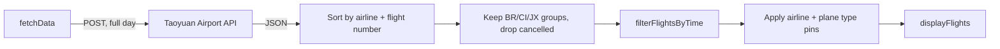
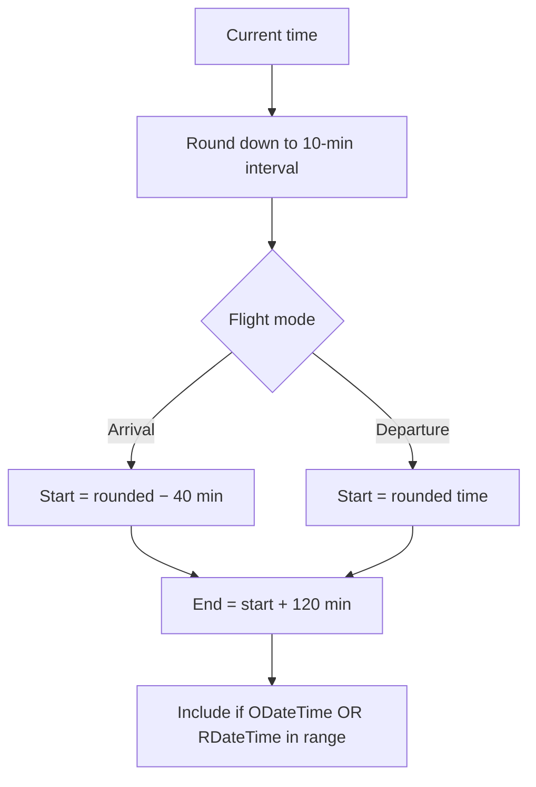
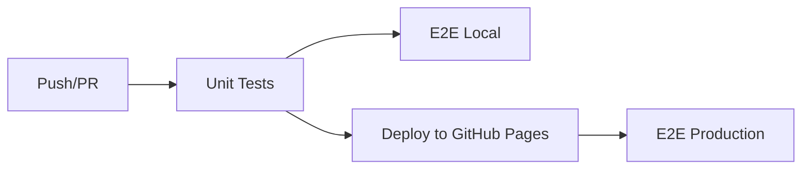

# TPE Sushi Go Round

[](https://github.com/tpe-eagle/tpe-sushi-go-round/actions/workflows/ci.yml)
[](https://opensource.org/licenses/MIT)

A mobile-first web app for Taoyuan International Airport flight information. Built for pilots and cabin crew on Taiwan's three major airlines to find their gate, carousel, and aircraft at a glance.

**Live site:** https://tpe-eagle.github.io/tpe-sushi-go-round/

## Features

- Real-time arrival / departure data from the Taoyuan Airport API
- 2-hour time window around the current time, filtered client-side
- Airlines: BR (EVA Air + B7 UNI Air), CI (China Airlines + AE Mandarin), JX (STARLUX)
- **Aircraft family filter** — pilots pin an airline then narrow to A321 / A330 / A350 / B777 / B787 etc. (family level, dynamic per airline)
- Traditional Chinese / English / Japanese with auto-detection
- Dark / light theme with system preference detection and cookie persistence
- Responsive mobile-first design (768px breakpoint), pull-to-refresh on mobile
- Installable PWA with Service Worker: app shell loads offline, last cached flight data is re-served with a staleness banner

## Quick Start

```bash
npm install
npm run dev       # http://localhost:8080
```

## Project Structure

```
tpe-sushi-go-round/
├── main.js                      # Application logic
├── style.scss                   # SCSS styling
├── index.html                   # SPA entry point
├── vite.config.js               # Vite build + Vitest config
├── src/
│   ├── utils/flightUtils.js     # Shared utilities (imported by unit tests)
│   └── test/                    # Unit tests (Vitest)
├── e2e/                         # E2E tests (Playwright)
├── .github/workflows/ci.yml     # CI/CD pipeline
├── .npmrc                       # legacy-peer-deps pin (see Tech Stack note)
└── public/                      # Favicons and PWA icons (manifest is generated by vite-plugin-pwa)
```

## Data Flow



- The API always receives `OTimeOpen: null, OTimeClose: null`; the 2-hour window is applied client-side.
- `localStorage` cache: 2-minute expiry online, any age accepted when offline; max 5 entries; disabled on localhost.
- Service Worker precaches the app shell only (HTML / JS / CSS / icons / webmanifest); the airport API and other external origins pass through to the network.

## Time Window



| Mode | Offset | Duration | Example (6:05 AM) |
|------|--------|----------|-------------------|
| Arrival (A) | −40 min | 120 min | 5:20 – 7:20 |
| Departure (D) | 0 min | 120 min | 6:00 – 8:00 |

All times are UTC+8.

## API Contract

| Field | Value |
|-------|-------|
| Endpoint | `https://www.taoyuan-airport.com/api/api/flight/a_flight` |
| Method | POST |
| `OTimeOpen` / `OTimeClose` | Always `null` (fetch full day) |
| `AState` | `A` (arrival) or `D` (departure) |
| `language` | `ch` / `en` / `jp` (Chinese is `ch`, not `zh`) |

## State & Persistence

| State | Storage | Expiry |
|-------|---------|--------|
| Airline filter (`ACode`) | Cookie | 7 days |
| Aircraft family (`PlaneType`) | Cookie | 7 days |
| Theme (`theme`) | Cookie | 7 days |
| Language | Detected from `navigator.language` | Not persisted |
| Flight data cache | `localStorage` | 2 minutes |

## Testing

```bash
npm run test:run          # Unit tests (Vitest)
npm run test:e2e:local    # Local E2E (Playwright, chromium)
npm run test:e2e:prod     # Production E2E (live site, multi-browser)
```

| Test File | Coverage |
|-----------|----------|
| `api.test.js` | Post data, time window math, filtering |
| `cache.test.js` | `localStorage` lifecycle, expiry, cleanup |
| `etag-integration.test.js` | ETag / 304 conditional requests |
| `planetype.test.js` | Family extraction, TBD handling, type filter |
| `api-integration.spec.js` | API parameters, display, mode switching |
| `language-detection.spec.js` | Three languages, browser detection |
| `user-interaction.spec.js` | Airline filter, theme, cookies, responsive |
| `plane-type.spec.js` | Plane type row, dynamic list, pin / clear, reconcile |
| `offline.spec.js` | Offline banner visibility on `offline` / `online` events |
| `production.spec.js` | Live site smoke tests |

E2E tests use smart API caching (first call real, subsequent cached for 30 minutes) and block Google Analytics to prevent tracking noise in test runs.

## CI/CD



| Job | Trigger | Blocking |
|-----|---------|----------|
| Unit Tests | push/PR to main | Yes |
| E2E Local | after unit tests | No |
| Deploy | push to main | Yes |
| E2E Production | after deploy | No |

## Tech Stack

| Category | Technology |
|----------|-----------|
| Frontend | Vanilla JS (ES module) + Bootstrap 5 |
| Styling | SCSS |
| Build | Vite 8 |
| PWA | vite-plugin-pwa (Workbox generateSW) |
| Unit Tests | Vitest |
| E2E Tests | Playwright |
| CI/CD | GitHub Actions → GitHub Pages |
| Runtime | Node.js 22 LTS |

> The repo ships an `.npmrc` with `legacy-peer-deps=true` because `vite-plugin-pwa@1.2.0` does not yet declare Vite 8 in its peer range. Drop the flag once the plugin ships a Vite 8–compatible release.

## Acknowledgments

- Taoyuan International Airport for providing the flight data API
- Taiwan's aviation community for inspiration
- All the flight crew members who deserve to get off work faster! ✈️

## License

MIT License — see [LICENSE](LICENSE) for details.

---

Made with ❤️ by EVA Pilot for Taiwan's aviation community
